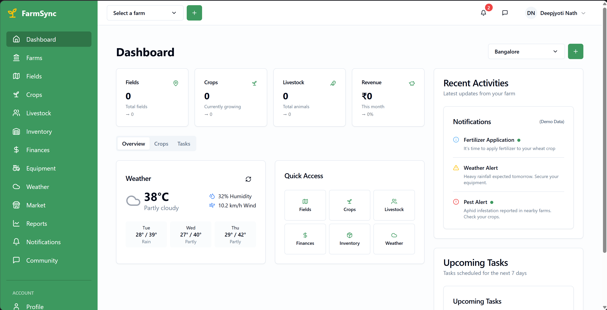

# FarmSync - Farm Management Application

FarmSync is a comprehensive farm management application designed to streamline operations on a modern farm. It provides tools for managing crops, livestock, fields, equipment, finances, and more, with a user-friendly interface and data-driven insights.



## Table of Contents

- [Overview](#overview)
- [Features](#features)
- [Technologies Used](#technologies-used)
- [Prerequisites](#prerequisites)
- [Installation](#installation)
- [Environment Variables](#environment-variables)
- [Supabase Setup](#supabase-setup)
- [Mapbox Integration](#mapbox-integration)
- [WeatherAPI.com Integration](#weatherapicom-integration)
- [Running the Application](#running-the-application)
- [Deployment](#deployment)
- [Future Enhancements](#future-enhancements)

## Overview

FarmSync helps farmers manage all aspects of their farming operations through an intuitive web interface. The application allows users to register farms, track fields and crops, monitor livestock, check weather forecasts, and manage finances - all in one place. With interactive mapping features powered by Mapbox, farmers can visualize their farm boundaries and calculate areas automatically.

## Features

### Farm Management
- Farm registration with detailed information
- Interactive farm boundary mapping with Mapbox
- Automatic area calculation from drawn boundaries
- Farm details display with GPS coordinates and map visualization
- Centralized farm listing and management

### Field & Crop Management
- Field registration with soil information
- Crop planning and status tracking
- Crop rotation and planting schedule
- Harvest forecasting and yield tracking

### Livestock Management
- Livestock registration and tracking
- Health and breeding records
- Feed management and cost tracking

### Weather Integration
- Real-time weather data for farm locations
- Weather forecasts and historical data
- Weather-based planning tools

### Financial Management
- Financial transaction recording
- Expense and income tracking
- Cost analysis by crop, field, or livestock

### Additional Features
- Dashboard with farm overview and key metrics
- Equipment tracking and maintenance scheduling
- Inventory management
- Community forums for farmer discussions
- Responsive design for desktop and mobile use

## Technologies Used

### Frontend
- **Framework**: React with TypeScript
- **Build Tool**: Vite
- **UI Components**: shadcn/ui (based on Radix UI)
- **Styling**: Tailwind CSS
- **State Management**: React Query for server state
- **Routing**: React Router

### Backend
- **Database & Authentication**: Supabase (PostgreSQL)
- **Storage**: Supabase Storage
- **Functions**: Supabase Edge Functions

### APIs & Integrations
- **Mapping**: Mapbox GL JS for maps, @mapbox/mapbox-gl-draw for boundary drawing
- **Weather**: WeatherAPI.com for weather data
- **Geospatial**: @mapbox/geojson-area for area calculations

### Database Schema
The application uses a PostgreSQL database through Supabase with the following main tables:

- **farms**: Stores farm information including boundaries as GeoJSON
- **fields**: Field information linked to farms
- **crops**: Crop information
- **field_crops**: Junction table linking fields and crops with planting details
- **livestock**: Livestock information
- **livestock_types**: Types of livestock
- **crop_activities**: Activities performed on crops
- **weather_data**: Weather information for farms
- **financial_transactions**: Financial records
- **equipment**: Farm equipment
- **inventory**: Inventory items
- **forums**, **forum_posts**, **post_comments**, **post_likes**: Community features

## Prerequisites

- Node.js (v16 or higher)
- npm or yarn
- Supabase account
- WeatherAPI.com API key
- Mapbox access token

## Installation

1. Clone the repository:

```sh
git clone https://github.com/deepjyoti31/farmsync.git
cd farmsync
```

2. Install dependencies:

```sh
npm install
# or
yarn install
```

3. Create a `.env` file in the root directory based on the `.env.example` file:

```sh
cp .env.example .env
```

## Environment Variables

Edit the `.env` file and add your environment variables:

```
# Supabase Configuration
VITE_SUPABASE_URL=your_supabase_url_here
VITE_SUPABASE_ANON_KEY=your_supabase_anon_key_here

# Mapbox Configuration
VITE_MAPBOX_ACCESS_TOKEN=your_mapbox_token_here
```

## Supabase Setup

1. Create a Supabase account at [supabase.com](https://supabase.com)

2. Create a new project in Supabase

3. Get your Supabase URL and anon key from the project settings (API section)

4. Add these values to your `.env` file

5. Apply the database migrations:

```sh
npx supabase login
npx supabase link --project-ref your_project_id
npx supabase db push
# or use our helper script
node supabase/apply-migrations.js
```

## Mapbox Integration

1. Create an account at [Mapbox](https://www.mapbox.com/)

2. Navigate to your account dashboard and create a new access token

3. Add the access token to your `.env` file:

```
VITE_MAPBOX_ACCESS_TOKEN=your_mapbox_token_here
```

## WeatherAPI.com Integration

1. Create an account at [WeatherAPI.com](https://www.weatherapi.com/)

2. Get your API key from the dashboard

3. Set up the environment variable for the Supabase Edge Function:

```sh
npx supabase secrets set WEATHER_API_KEY="your_api_key" --project-ref your_project_id
# or use our helper script
node supabase/setup-env-vars.js
```

## Running the Application

Start the development server:

```sh
npm run dev
# or
yarn dev
```

The application will be available at `http://localhost:8080`

## Deployment

Build the application for production:

```sh
npm run build
# or
yarn build
```

The built files will be in the `dist` directory, which you can deploy to any static hosting service.

For Supabase Edge Functions deployment:

```sh
npx supabase functions deploy get-weather --project-ref your_project_id
```

## Future Enhancements

FarmSync is continuously evolving with plans for the following enhancements:

### Advanced Analytics and Insights
- Yield prediction using machine learning
- Crop performance comparison across seasons
- Profitability analysis by crop, field, and season
- Resource optimization recommendations

### Mobile Optimization and Offline Capabilities
- Progressive Web App (PWA) with offline functionality
- Mobile-specific features like GPS field mapping
- Photo and voice documentation in the field
- QR code integration for equipment and livestock

### IoT and Sensor Integration
- Weather station and soil moisture sensor integration
- Equipment sensors for usage and maintenance tracking
- Automated alerts based on sensor thresholds

### Enhanced Crop Management
- AI-powered pest and disease identification
- Visual crop rotation planning tools
- Precision agriculture with field zoning

### Sustainability and Environmental Impact
- Carbon footprint tracking and reduction suggestions
- Biodiversity monitoring tools
- Water management and conservation planning

### Augmented Reality and Visual Tools
- AR visualization of crop growth stages
- Drone imagery integration
- 3D farm modeling for planning

For a detailed roadmap of planned enhancements, see the project_tracker.md file.
